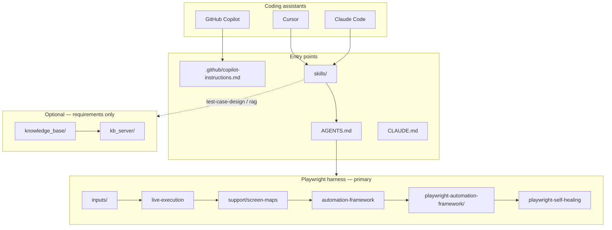

# AIQE — Playwright Harness Engineering

A **reusable, application-agnostic** harness for AI-assisted Playwright automation. QA and engineers capture **live UI evidence**, generate **Page Object Model** tests from screen maps, run Playwright, and self-heal failures — without inventing selectors.

Your application-specific content goes in `inputs/` and generated files under `playwright-automation-framework/`. The repo template stays app-neutral.

## Architecture



| Path | Role |
|------|------|
| [`skills/`](skills/) | Canonical agent workflows (symlinked by Cursor & Claude Code) |
| [`inputs/`](inputs/) | Your manual flows and test cases |
| [`playwright-automation-framework/`](playwright-automation-framework/) | POM, config, tests, screen maps, reports |
| [`kb_server/`](kb_server/) + [`knowledge_base/`](knowledge_base/) | Optional RAG — not used for UI selectors |

---

## Guidelines for QA

Use this section if you are a **QA engineer** adopting the framework in Cursor.

### What you get

| Without harness | With harness |
|-----------------|--------------|
| Manual steps re-typed into automation | Flow written once in markdown |
| Fragile / guessed selectors | Selectors from **live screen maps** (real DOM) |
| Scattered spec + page code | POM layout: pages, flows, e2e specs |
| Flaky fixes by weakening asserts | **Self-healing** for waits/locators only |

### Register your coding assistant

Skills work with **Cursor**, **Claude Code**, and **GitHub Copilot**. One-time setup per tool:

| Assistant | Registration guide |
|-----------|---------------------|
| **Cursor** | [docs/register-your-assistant.md](docs/register-your-assistant.md#cursor) |
| **Claude Code** | [docs/register-your-assistant.md](docs/register-your-assistant.md#claude-code) |
| **GitHub Copilot** | [docs/register-your-assistant.md](docs/register-your-assistant.md#github-copilot) |

Canonical skills: [`skills/`](skills/) (Cursor/Claude symlink in repo). Copilot uses [`.github/copilot-instructions.md`](.github/copilot-instructions.md).

Use skills in **other repos** (personal install): `bash scripts/install-skills-personal.sh`

### Prerequisites

| Requirement | Notes |
|-------------|--------|
| **Coding assistant** | Cursor, Claude Code, or Copilot (see register guide above) |
| **Node.js 18+** | For Playwright |
| **Target app URL** | Staging or test environment you are allowed to automate |
| **MCP browser** | `npm run setup:mcp` — registers `@playwright/mcp` with `autoStart` in `.mcp.json` ([MCP setup](docs/mcp-setup.md)) |
| **Manual flow** | Steps you would run manually (see template below) |

Optional: Jira credentials in `.mcp.json` for reporting; Python + `ANTHROPIC_API_KEY` only if using RAG (not for selectors).

### One-time setup

```bash
git clone <this-repo>
cd <repo>
npm run setup:playwright   # includes setup:mcp (Playwright MCP autoStart)
npm run verify:mcp         # confirm @playwright/mcp + .mcp.json
```

Reload **Cursor MCP** after setup (Settings → MCP → `playwright` should be green).

Edit `playwright-automation-framework/.env`:

```env
BASE_URL=https://your-app-staging.example.com
```

Verify the scaffold:

```bash
npm test          # 2 skipped placeholders — OK before first feature
npm run typecheck
```

`setup:mcp` creates `.mcp.json` from `.mcp.json.example` (Playwright + optional Jira). Set `ATLASSIAN_*` env vars only if you use Jira reporting.

### QA workflow (recommended)

```text
1. Write flow          → inputs/manual-flows/<feature>.md
2. Run in Cursor       → harness-engineering skill (full pipeline)
3. Review artifacts    → screen map, pages, flows, e2e spec
4. Run tests locally   → npx playwright test tests/e2e/<feature>.spec.ts
5. Fix automation      → playwright-self-healing (if needed)
6. Report (optional)   → test-jira-reporter + JIRA ticket key
```

#### Step 1 — Write your manual flow

```bash
cp inputs/manual-flows/example-flow.template.md inputs/manual-flows/checkout.md
```

Fill in the table: **action**, **target** (button/field name), **expected signal** (URL, message, next screen). Use a short **feature slug** matching the filename (`checkout` → `checkout.screen.json`, `checkout.spec.ts`).

Example row:

| Step | Action | Expected signal |
|------|--------|-----------------|
| 3 | Click **Place order** | Redirect to `/order-confirmation`; heading "Thank you" |

More detail: [inputs/README.md](inputs/README.md).

#### Step 2 — Run the harness in Cursor

Open Cursor in this repo and prompt, for example:

```text
Run harness-engineering for feature "checkout".
Flow: inputs/manual-flows/checkout.md
BASE_URL is in playwright-automation-framework/.env
```

The agent should:

1. **live-execution** — open the app in MCP browser, capture `support/screen-maps/checkout.screen.json`, run your steps, save an execution report  
2. **automation-framework** — generate POM code from the screen map only  
3. **Verify** — run Playwright on `tests/e2e/checkout.spec.ts`  
4. **playwright-self-healing** — if tests fail (locators/timing), up to 3 fix attempts  

Say the **feature slug** explicitly (e.g. `checkout`, not a long sentence).

#### Step 3 — Review before you trust the run

| Artifact | What to check |
|----------|----------------|
| `support/screen-maps/<feature>.screen.json` | Intents match your UI; selectors look stable (`data-testid`, aria, not random CSS) |
| `pages/<feature>.page.ts` | No hard-coded selectors bypassing the screen map |
| `tests/e2e/<feature>.spec.ts` | Assertions match your expected signals |
| `reports/generation-manifest.json` | Any `RISK:` flags (missing selector, stale map, heuristic fix) |

#### Step 4 — Run tests yourself

```bash
cd playwright-automation-framework
npx playwright test tests/e2e/<feature>.spec.ts
npx playwright show-report reports/html
```

From repo root: `npm run test:regression` (all e2e specs).

#### Step 5 — When tests fail

In Cursor:

```text
Use playwright-self-healing for tests/e2e/checkout.spec.ts.
Use the screen map and Playwright report; do not remove assertions.
```

Re-capture the screen map if the UI changed significantly (**live-execution** again).

#### Step 6 — JIRA (optional)

Provide a ticket key (e.g. `PROJ-123`):

```text
Use test-jira-reporter for PROJ-123, feature checkout, with latest Playwright output.
```

### Optional QA paths

| Goal | Skill | Input |
|------|-------|--------|
| Structured test cases first | [test-case-design](skills/test-case-design/SKILL.md) | Requirement or story → `inputs/test-cases/test_cases_<feature>.md` |
| Requirements context (not selectors) | [rag](skills/rag/SKILL.md) | Ingest docs; query before test-case design |
| Smoke-only run later | Tag specs `@smoke` | `npm run test:smoke` |

### Rules QA should know

1. **Selectors come from live screen maps only** — not from RAG, not from guessing, not from old recordings alone.  
2. **Capture screen maps before clicking** on each new page or modal.  
3. **Do not approve** automation that weakens product assertions to force green tests.  
4. **Per-app flows** are usually gitignored — keep them in your project or team repo per [`.gitignore`](.gitignore).  
5. After real specs exist, remove `harness-placeholder` specs (automation-framework step).

### Troubleshooting (QA)

| Problem | What to do |
|---------|------------|
| `BASE_URL is required` | Create `playwright-automation-framework/.env` from `.env.example` |
| Agent invents selectors | Insist on **live-execution** first; refuse generation without screen map |
| `No screen map entry for intent` | Re-run live capture or rename intents in map + `selectors.ts` |
| Test passes in MCP but fails in Playwright | Run **self-healing**; check `BASE_URL`, login, cookies |
| CAPTCHA / payment / SMS OTP | Stop automation; document as manual-only blocker |
| Empty test run | Run harness-engineering first; placeholders skip until then |

### Cursor skills quick reference

| Skill | When QA uses it |
|-------|-----------------|
| [harness-engineering](skills/harness-engineering/SKILL.md) | **Start here** — end-to-end for one feature |
| [live-execution](skills/live-execution/SKILL.md) | Re-capture UI or new page/modal only |
| [automation-framework](skills/automation-framework/SKILL.md) | Regenerate code after screen map update |
| [playwright-self-healing](skills/playwright-self-healing/SKILL.md) | Failed Playwright run |
| [test-jira-reporter](skills/test-jira-reporter/SKILL.md) | Post results to Jira |
| [test-case-design](skills/test-case-design/SKILL.md) | Formal TC markdown before automation |

Full index: [skills/README.md](skills/README.md)

Templates for generated code: [playwright-automation-framework/TEMPLATES.md](playwright-automation-framework/TEMPLATES.md).

---

## Guidelines for KB (optional)

The **knowledge base (KB)** helps with **what to test** (requirements, rules, test cases). The **Playwright harness** handles **how to automate** (selectors from live UI). They complement each other; neither replaces the other.

Full reference: [docs/kb-guidelines.md](docs/kb-guidelines.md) · Agent skill: [skills/rag/SKILL.md](skills/rag/SKILL.md)

### When to use KB

| Use KB | Do not use KB |
|--------|----------------|
| Requirements, user stories, acceptance criteria in `.md` | CSS/XPath selectors for Playwright |
| [test-case-design](skills/test-case-design/SKILL.md) before automation | Discovering live UI (use **live-execution**) |
| Domain rules, error messages documented in docs | Verifying tests pass (use `npx playwright test`) |
| “What should happen?” when docs exist | Guessing behaviour not in the KB |

### KB vs harness (important)

```text
KB (optional)     →  requirements / test ideas  →  inputs/test-cases/*.md
Harness (required) →  live UI evidence          →  screen maps → POM → tests/e2e/*.spec.ts
```

**Rule:** Every Playwright selector must come from `support/screen-maps/<feature>.screen.json`, never from a RAG query.

### One-time setup

```bash
npm run setup:kb
export ANTHROPIC_API_KEY=your_key
```

Installs Python deps from `requirements.txt` (includes `kb_server/` + `knowledge_base/`).

### Ingest your documents

Load markdown into the local vector store (`knowledge_base/vector/chroma_db/`):

```bash
# Recommended: requirements + test inputs
python3 knowledge_base/vector/ingest.py inputs/

# Or wider corpus (project docs, skills, flows)
python3 knowledge_base/vector/ingest.py .
```

Re-run ingest when requirements change. Use `--no-reset` on `ingest.py` to append only new files.

### Query from the command line

```bash
python3 knowledge_base/vector/query.py "payment validation rules for checkout" --n 5
```

Use results when writing test cases or reviewing coverage. If the KB has no answer, document `[KB gap — not documented]` — do not invent rules.

### Run the KB API (optional)

```bash
npm run kb:serve
```

| Endpoint | Purpose |
|----------|---------|
| `GET /health` | Check server is up |
| `POST /kb/ingest` | Ingest via API (`directory`, `reset`) |
| `GET /kb/docs` | List indexed source files |
| `POST /kb/chat` | Agentic Q&A (uses Claude + retrieval) |
| `POST /kb/chat/legacy` | Simple one-shot RAG |

Default URL: `http://127.0.0.1:8765` (override with `KB_BIND_HOST`, `KB_BIND_PORT`).

### Suggested QA workflow with KB

1. Ingest requirement docs + `inputs/` (if any).
2. Query KB or use **test-case-design** → `inputs/test-cases/test_cases_<feature>.md`.
3. Run **harness-engineering** with `inputs/manual-flows/<feature>.md` or test cases (screen maps + automation).

You can skip KB entirely if you only have a manual flow markdown and do not need formal test-case design.

### KB troubleshooting

| Problem | What to do |
|---------|------------|
| `Collection not found` | Run `ingest.py` first |
| Weak / empty search results | Ingest more `.md`; try a broader query |
| Agent cites wrong behaviour | Re-ingest; enforce [rag](skills/rag/SKILL.md) KB-only rules |
| `ANTHROPIC_API_KEY is missing` | Set env var before `kb:serve` or agentic chat |
| Team expects KB to fix selectors | Redirect to **live-execution** — KB cannot see the live DOM |

---

## For engineers / platform owners

| Topic | Doc |
|-------|-----|
| **Register assistant (QA handout)** | [docs/register-your-assistant.md](docs/register-your-assistant.md) |
| **KB / RAG (optional)** | [docs/kb-guidelines.md](docs/kb-guidelines.md) |
| Deploy / fork / monorepo copy | [docs/DEPLOY.md](docs/DEPLOY.md) |
| CI | [.github/workflows/harness-ci.yml](.github/workflows/harness-ci.yml) |
| Agent routing | [AGENTS.md](AGENTS.md) · [CLAUDE.md](CLAUDE.md) |

## What ships in the framework

| Layer | Purpose |
|-------|---------|
| **Skills** ([`skills/`](skills/)) | Agent workflows (Cursor / Claude / Copilot) |
| **Framework** (`playwright-automation-framework/`) | POM layout, config, helpers, `TEMPLATES.md` |
| **Inputs** (`inputs/`) | Your manual flows and test cases |
| **Scripts** (`scripts/`) | Setup and test-case writer |
| **Knowledge base** (`knowledge_base/` + `kb_server/`) | Optional RAG — not for UI selectors |

## Pipeline

```text
your inputs → live-execution → automation-framework → playwright test → self-healing (optional)
```

## Commands

```bash
npm run setup:playwright   # harness (QA minimum)
npm run setup              # harness + optional KB
npm test                   # all projects
npm run test:smoke
npm run test:regression
npm run typecheck
npm run setup:kb           # optional KB only
npm run kb:serve           # optional RAG API — see Guidelines for KB
```

See [Guidelines for KB (optional)](#guidelines-for-kb-optional) for ingest, query, and API usage.
